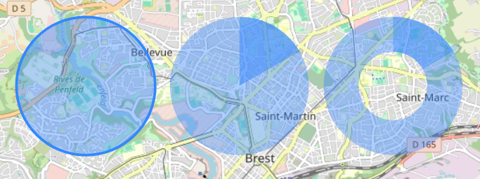

# Extra circular shapes for Leaflet

Provides some missing shapes to Leaflet :

- Disk (simply a `Circle` without borders)
- Annulus
- Disk sector
- Annulus sector



## Using the plugin

This plugin targets both Leaflet v1 and v2, but the internal are written with v2 in mind.

### Leaflet 1.x

```html
    <script src="https://unpkg.com/leaflet@1.9.4/dist/leaflet.js"></script>
    <script src="/dist/leafletv1-circularshapes.js"></script>
    ...
    <script>
      var map = L.map('map').setView([48.398, -4.455], 13);
      var tiles = L.tileLayer(...).addTo(map);
      var annulusSector = annulussector([48.396, -4.481], {
          radius: 1000,
          innerRadius: 500,
          startAngle: 0,
          stopAngle: 60
      }).addTo(map);
    </script>
```

### Leaflet 2.x

```html
    <script type="importmap">
      {
        "imports": {
          "leaflet": "https://unpkg.com/leaflet@2.0.0-alpha.1/dist/leaflet.js",
          "leaflet-circularshapes": "/dist/leaflet-circularshapes.js"
        }
      }
    </script>
    ...
    <script type="module">
      import {Map, TileLayer} from "leaflet";
      import {AnnulusSector} from "leaflet-circularshapes";
      const map = new Map('map').setView([48.398, -4.455], 13);
      const tiles = new TileLayer(...).addTo(map);
      const annulusSector = new AnnulusSector([48.396, -4.481], {
        radius: 1000,
        innerRadius: 500,
        startAngle: 0,
        stopAngle: 60
    }).addTo(map);
    </script>
```

## Author information

Code for drawing annuluses from Florian Bischof <https://github.com/Falke-Design/L.Donut>.  
Code for drawing disk sectors from Jan Pieter Waagmeester <https://github.com/jieter/Leaflet-semicircle>.  
Code for drawing annulus sectors from Tristan Le Guern.
